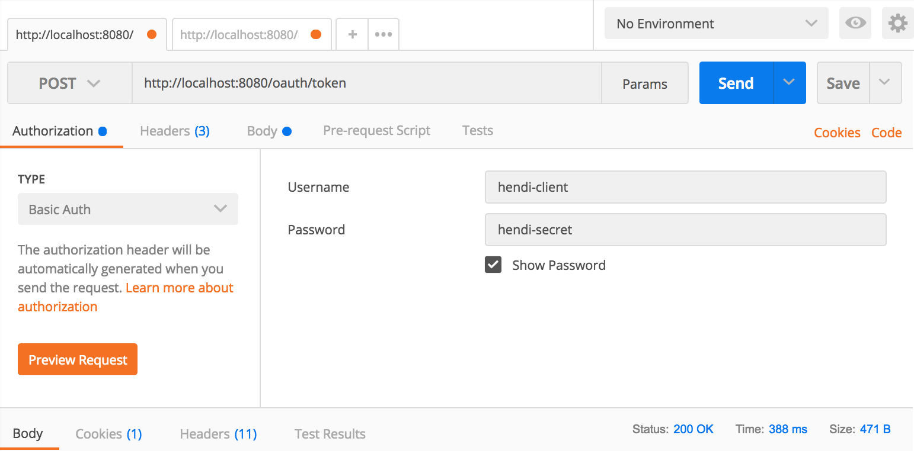
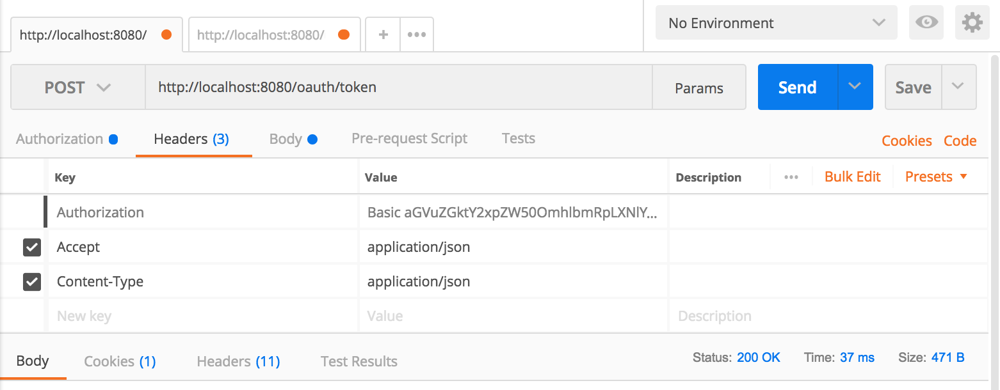
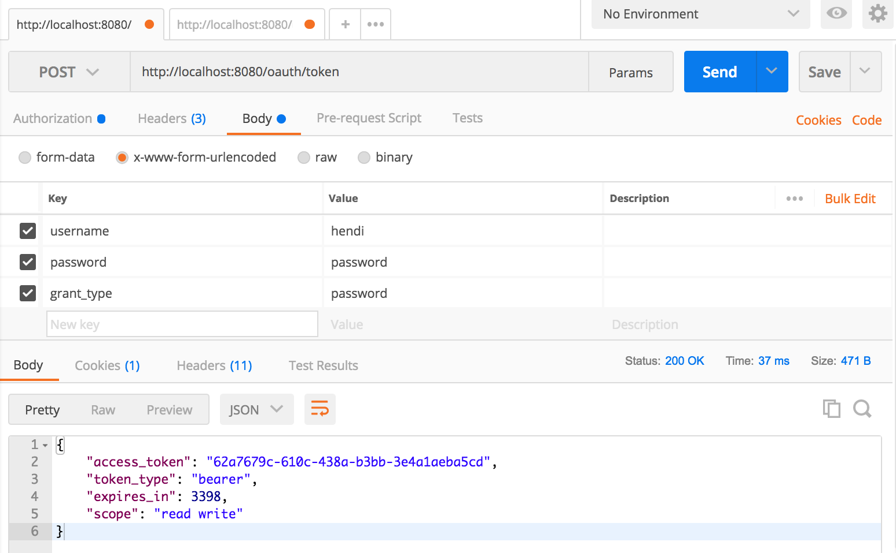
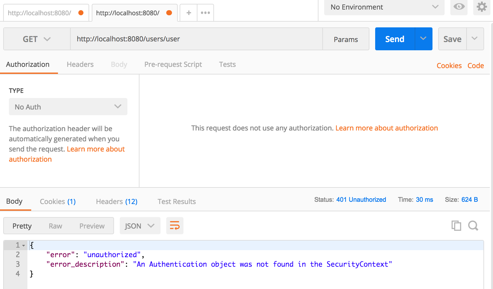
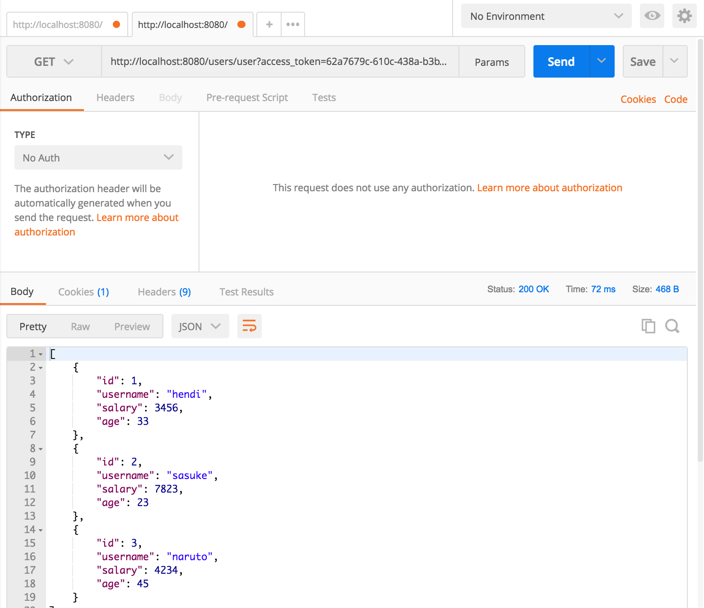

# Spring Boot Security OAuth Example

#### Securing REST API with Spring Security OAuth2

To run this repo, please follow these command :

1. Paste this command to your terminal

    `mvn clean spring-boot:run`

2. Launch POSTMAN to generate TOKEN

    

    

    

3. Accessing without Token

    

4. Accessing Resource With Token

    
